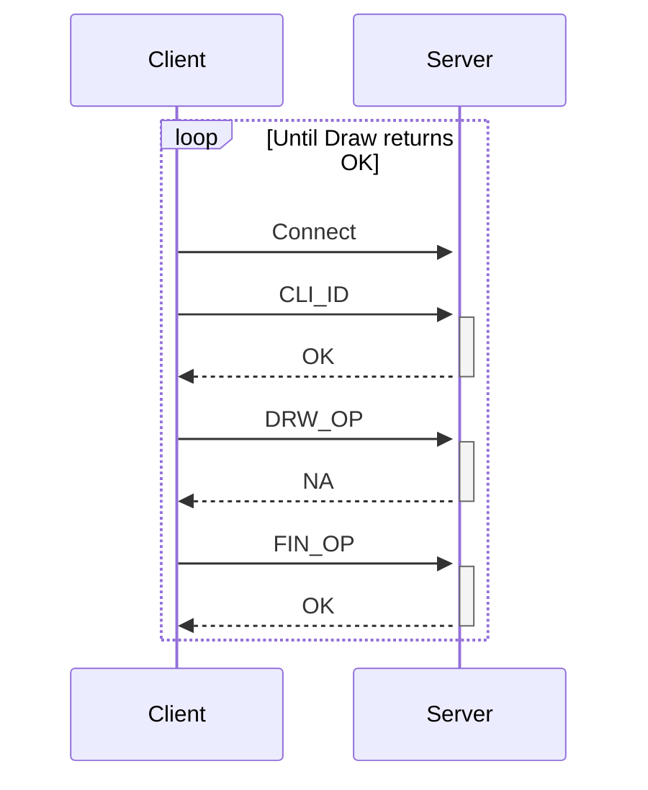
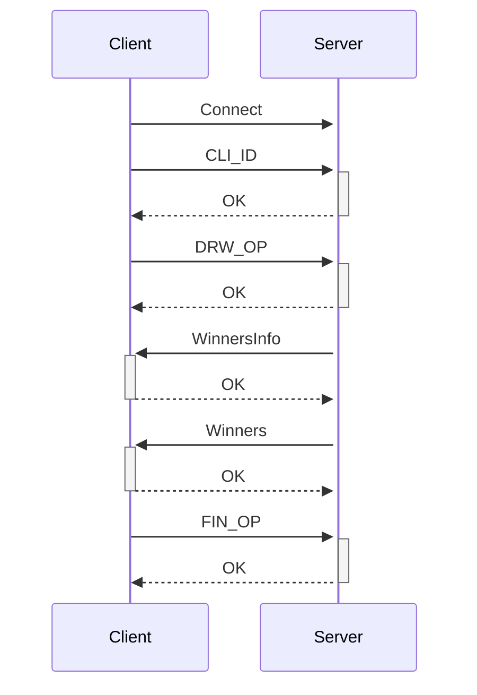

# TP0: Docker + Comunicaciones + Concurrencia

En el presente repositorio se provee un esqueleto básico de cliente/servidor, en donde todas las dependencias del mismo se encuentran encapsuladas en containers. Los alumnos deberán resolver una guía de ejercicios incrementales, teniendo en cuenta las condiciones de entrega descritas al final de este enunciado.

El cliente (Golang) y el servidor (Python) fueron desarrollados en diferentes lenguajes simplemente para mostrar cómo dos lenguajes de programación pueden convivir en el mismo proyecto con la ayuda de containers, en este caso utilizando [Docker Compose](https://docs.docker.com/compose/).

## Instrucciones de uso

El repositorio cuenta con un **Makefile** que incluye distintos comandos en forma de targets. Los targets se ejecutan mediante la invocación de: **make \<target\>**. Los target imprescindibles para iniciar y detener el sistema son **docker-compose-up** y **docker-compose-down**, siendo los restantes targets de utilidad para el proceso de depuración.

Los targets disponibles son:

| target                | accion                                                                                                                                                                                                                                                                                                                                                                |
| --------------------- | --------------------------------------------------------------------------------------------------------------------------------------------------------------------------------------------------------------------------------------------------------------------------------------------------------------------------------------------------------------------- |
| `docker-compose-up`   | Inicializa el ambiente de desarrollo. Construye las imágenes del cliente y el servidor, inicializa los recursos a utilizar (volúmenes, redes, etc) e inicia los propios containers.                                                                                                                                                                                   |
| `docker-compose-down` | Ejecuta `docker-compose stop` para detener los containers asociados al compose y luego `docker-compose down` para destruir todos los recursos asociados al proyecto que fueron inicializados. Se recomienda ejecutar este comando al finalizar cada ejecución para evitar que el disco de la máquina host se llene de versiones de desarrollo y recursos sin liberar. |
| `docker-compose-logs` | Permite ver los logs actuales del proyecto. Acompañar con `grep` para lograr ver mensajes de una aplicación específica dentro del compose.                                                                                                                                                                                                                            |
| `docker-image`        | Construye las imágenes a ser utilizadas tanto en el servidor como en el cliente. Este target es utilizado por **docker-compose-up**, por lo cual se lo puede utilizar para probar nuevos cambios en las imágenes antes de arrancar el proyecto.                                                                                                                       |
| `build`               | Compila la aplicación cliente para ejecución en el _host_ en lugar de en Docker. De este modo la compilación es mucho más veloz, pero requiere contar con todo el entorno de Golang y Python instalados en la máquina _host_.                                                                                                                                         |

### Servidor

Se trata de un "echo server", en donde los mensajes recibidos por el cliente se responden inmediatamente y sin alterar.

Se ejecutan en bucle las siguientes etapas:

1. Servidor acepta una nueva conexión.
2. Servidor recibe mensaje del cliente y procede a responder el mismo.
3. Servidor desconecta al cliente.
4. Servidor retorna al paso 1.

### Cliente

se conecta reiteradas veces al servidor y envía mensajes de la siguiente forma:

1. Cliente se conecta al servidor.
2. Cliente genera mensaje incremental.
3. Cliente envía mensaje al servidor y espera mensaje de respuesta.
4. Servidor responde al mensaje.
5. Servidor desconecta al cliente.
6. Cliente verifica si aún debe enviar un mensaje y si es así, vuelve al paso 2.

### Ejemplo

Al ejecutar el comando `make docker-compose-up` y luego `make docker-compose-logs`, se observan los siguientes logs:

```
client1  | 2024-08-21 22:11:15 INFO     action: config | result: success | client_id: 1 | server_address: server:12345 | loop_amount: 5 | loop_period: 5s | log_level: DEBUG
client1  | 2024-08-21 22:11:15 INFO     action: receive_message | result: success | client_id: 1 | msg: [CLIENT 1] Message N°1
server   | 2024-08-21 22:11:14 DEBUG    action: config | result: success | port: 12345 | listen_backlog: 5 | logging_level: DEBUG
server   | 2024-08-21 22:11:14 INFO     action: accept_connections | result: in_progress
server   | 2024-08-21 22:11:15 INFO     action: accept_connections | result: success | ip: 172.25.125.3
server   | 2024-08-21 22:11:15 INFO     action: receive_message | result: success | ip: 172.25.125.3 | msg: [CLIENT 1] Message N°1
server   | 2024-08-21 22:11:15 INFO     action: accept_connections | result: in_progress
server   | 2024-08-21 22:11:20 INFO     action: accept_connections | result: success | ip: 172.25.125.3
server   | 2024-08-21 22:11:20 INFO     action: receive_message | result: success | ip: 172.25.125.3 | msg: [CLIENT 1] Message N°2
server   | 2024-08-21 22:11:20 INFO     action: accept_connections | result: in_progress
client1  | 2024-08-21 22:11:20 INFO     action: receive_message | result: success | client_id: 1 | msg: [CLIENT 1] Message N°2
server   | 2024-08-21 22:11:25 INFO     action: accept_connections | result: success | ip: 172.25.125.3
server   | 2024-08-21 22:11:25 INFO     action: receive_message | result: success | ip: 172.25.125.3 | msg: [CLIENT 1] Message N°3
client1  | 2024-08-21 22:11:25 INFO     action: receive_message | result: success | client_id: 1 | msg: [CLIENT 1] Message N°3
server   | 2024-08-21 22:11:25 INFO     action: accept_connections | result: in_progress
server   | 2024-08-21 22:11:30 INFO     action: accept_connections | result: success | ip: 172.25.125.3
server   | 2024-08-21 22:11:30 INFO     action: receive_message | result: success | ip: 172.25.125.3 | msg: [CLIENT 1] Message N°4
server   | 2024-08-21 22:11:30 INFO     action: accept_connections | result: in_progress
client1  | 2024-08-21 22:11:30 INFO     action: receive_message | result: success | client_id: 1 | msg: [CLIENT 1] Message N°4
server   | 2024-08-21 22:11:35 INFO     action: accept_connections | result: success | ip: 172.25.125.3
server   | 2024-08-21 22:11:35 INFO     action: receive_message | result: success | ip: 172.25.125.3 | msg: [CLIENT 1] Message N°5
client1  | 2024-08-21 22:11:35 INFO     action: receive_message | result: success | client_id: 1 | msg: [CLIENT 1] Message N°5
server   | 2024-08-21 22:11:35 INFO     action: accept_connections | result: in_progress
client1  | 2024-08-21 22:11:40 INFO     action: loop_finished | result: success | client_id: 1
client1 exited with code 0
```

## Parte 1: Introducción a Docker

En esta primera parte del trabajo práctico se plantean una serie de ejercicios que sirven para introducir las herramientas básicas de Docker que se utilizarán a lo largo de la materia. El entendimiento de las mismas será crucial para el desarrollo de los próximos TPs.

### Ejercicio N°1:

Definir un script de bash `generar-compose.sh` que permita crear una definición de Docker Compose con una cantidad configurable de clientes. El nombre de los containers deberá seguir el formato propuesto: client1, client2, client3, etc.

El script deberá ubicarse en la raíz del proyecto y recibirá por parámetro el nombre del archivo de salida y la cantidad de clientes esperados:

`./generar-compose.sh docker-compose-dev.yaml 5`

Considerar que en el contenido del script pueden invocar un subscript de Go o Python:

```
#!/bin/bash
echo "Nombre del archivo de salida: $1"
echo "Cantidad de clientes: $2"
python3 mi-generador.py $1 $2
```

En el archivo de Docker Compose de salida se pueden definir volúmenes, variables de entorno y redes con libertad, pero recordar actualizar este script cuando se modifiquen tales definiciones en los sucesivos ejercicios.

### Ejercicio N°2:

Modificar el cliente y el servidor para lograr que realizar cambios en el archivo de configuración no requiera reconstruír las imágenes de Docker para que los mismos sean efectivos. La configuración a través del archivo correspondiente (`config.ini` y `config.yaml`, dependiendo de la aplicación) debe ser inyectada en el container y persistida por fuera de la imagen (hint: `docker volumes`).

### Ejercicio N°3:

Crear un script de bash `validar-echo-server.sh` que permita verificar el correcto funcionamiento del servidor utilizando el comando `netcat` para interactuar con el mismo. Dado que el servidor es un echo server, se debe enviar un mensaje al servidor y esperar recibir el mismo mensaje enviado.

En caso de que la validación sea exitosa imprimir: `action: test_echo_server | result: success`, de lo contrario imprimir:`action: test_echo_server | result: fail`.

El script deberá ubicarse en la raíz del proyecto. Netcat no debe ser instalado en la máquina _host_ y no se pueden exponer puertos del servidor para realizar la comunicación (hint: `docker network`). `

### Ejercicio N°4:

Modificar servidor y cliente para que ambos sistemas terminen de forma _graceful_ al recibir la signal SIGTERM. Terminar la aplicación de forma _graceful_ implica que todos los _file descriptors_ (entre los que se encuentran archivos, sockets, threads y procesos) deben cerrarse correctamente antes que el thread de la aplicación principal muera. Loguear mensajes en el cierre de cada recurso (hint: Verificar que hace el flag `-t` utilizado en el comando `docker compose down`).

## Parte 2: Repaso de Comunicaciones

Las secciones de repaso del trabajo práctico plantean un caso de uso denominado **Lotería Nacional**. Para la resolución de las mismas deberá utilizarse como base el código fuente provisto en la primera parte, con las modificaciones agregadas en el ejercicio 4.

### Ejercicio N°5:

Modificar la lógica de negocio tanto de los clientes como del servidor para nuestro nuevo caso de uso.

#### Cliente

Emulará a una _agencia de quiniela_ que participa del proyecto. Existen 5 agencias. Deberán recibir como variables de entorno los campos que representan la apuesta de una persona: nombre, apellido, DNI, nacimiento, numero apostado (en adelante 'número'). Ej.: `NOMBRE=Santiago Lionel`, `APELLIDO=Lorca`, `DOCUMENTO=30904465`, `NACIMIENTO=1999-03-17` y `NUMERO=7574` respectivamente.

Los campos deben enviarse al servidor para dejar registro de la apuesta. Al recibir la confirmación del servidor se debe imprimir por log: `action: apuesta_enviada | result: success | dni: ${DNI} | numero: ${NUMERO}`.

#### Servidor

Emulará a la _central de Lotería Nacional_. Deberá recibir los campos de la cada apuesta desde los clientes y almacenar la información mediante la función `store_bet(...)` para control futuro de ganadores. La función `store_bet(...)` es provista por la cátedra y no podrá ser modificada por el alumno.
Al persistir se debe imprimir por log: `action: apuesta_almacenada | result: success | dni: ${DNI} | numero: ${NUMERO}`.

#### Comunicación:

Se deberá implementar un módulo de comunicación entre el cliente y el servidor donde se maneje el envío y la recepción de los paquetes, el cual se espera que contemple:

- Definición de un protocolo para el envío de los mensajes.
- Serialización de los datos.
- Correcta separación de responsabilidades entre modelo de dominio y capa de comunicación.
- Correcto empleo de sockets, incluyendo manejo de errores y evitando los fenómenos conocidos como [_short read y short write_](https://cs61.seas.harvard.edu/site/2018/FileDescriptors/).

### Ejercicio N°6:

Modificar los clientes para que envíen varias apuestas a la vez (modalidad conocida como procesamiento por _chunks_ o _batchs_).
Los _batchs_ permiten que el cliente registre varias apuestas en una misma consulta, acortando tiempos de transmisión y procesamiento.

La información de cada agencia será simulada por la ingesta de su archivo numerado correspondiente, provisto por la cátedra dentro de `.data/datasets.zip`.
Los archivos deberán ser inyectados en los containers correspondientes y persistido por fuera de la imagen (hint: `docker volumes`), manteniendo la convencion de que el cliente N utilizara el archivo de apuestas `.data/agency-{N}.csv` .

En el servidor, si todas las apuestas del _batch_ fueron procesadas correctamente, imprimir por log: `action: apuesta_recibida | result: success | cantidad: ${CANTIDAD_DE_APUESTAS}`. En caso de detectar un error con alguna de las apuestas, debe responder con un código de error a elección e imprimir: `action: apuesta_recibida | result: fail | cantidad: ${CANTIDAD_DE_APUESTAS}`.

La cantidad máxima de apuestas dentro de cada _batch_ debe ser configurable desde config.yaml. Respetar la clave `batch: maxAmount`, pero modificar el valor por defecto de modo tal que los paquetes no excedan los 8kB.

Por su parte, el servidor deberá responder con éxito solamente si todas las apuestas del _batch_ fueron procesadas correctamente.

### Ejercicio N°7:

Modificar los clientes para que notifiquen al servidor al finalizar con el envío de todas las apuestas y así proceder con el sorteo.
Inmediatamente después de la notificacion, los clientes consultarán la lista de ganadores del sorteo correspondientes a su agencia.
Una vez el cliente obtenga los resultados, deberá imprimir por log: `action: consulta_ganadores | result: success | cant_ganadores: ${CANT}`.

El servidor deberá esperar la notificación de las 5 agencias para considerar que se realizó el sorteo e imprimir por log: `action: sorteo | result: success`.
Luego de este evento, podrá verificar cada apuesta con las funciones `load_bets(...)` y `has_won(...)` y retornar los DNI de los ganadores de la agencia en cuestión. Antes del sorteo no se podrán responder consultas por la lista de ganadores con información parcial.

Las funciones `load_bets(...)` y `has_won(...)` son provistas por la cátedra y no podrán ser modificadas por el alumno.

No es correcto realizar un broadcast de todos los ganadores hacia todas las agencias, se espera que se informen los DNIs ganadores que correspondan a cada una de ellas.

## Parte 3: Repaso de Concurrencia

En este ejercicio es importante considerar los mecanismos de sincronización a utilizar para el correcto funcionamiento de la persistencia.

### Ejercicio N°8:

Modificar el servidor para que permita aceptar conexiones y procesar mensajes en paralelo. En caso de que el alumno implemente el servidor en Python utilizando _multithreading_, deberán tenerse en cuenta las [limitaciones propias del lenguaje](https://wiki.python.org/moin/GlobalInterpreterLock).

## Condiciones de Entrega

Se espera que los alumnos realicen un _fork_ del presente repositorio para el desarrollo de los ejercicios y que aprovechen el esqueleto provisto tanto (o tan poco) como consideren necesario.

Cada ejercicio deberá resolverse en una rama independiente con nombres siguiendo el formato `ej${Nro de ejercicio}`. Se permite agregar commits en cualquier órden, así como crear una rama a partir de otra, pero al momento de la entrega deberán existir 8 ramas llamadas: ej1, ej2, ..., ej7, ej8.
(hint: verificar listado de ramas y últimos commits con `git ls-remote`)

Se espera que se redacte una sección del README en donde se indique cómo ejecutar cada ejercicio y se detallen los aspectos más importantes de la solución provista, como ser el protocolo de comunicación implementado (Parte 2) y los mecanismos de sincronización utilizados (Parte 3).

Se proveen [pruebas automáticas](https://github.com/7574-sistemas-distribuidos/tp0-tests) de caja negra. Se exige que la resolución de los ejercicios pase tales pruebas, o en su defecto que las discrepancias sean justificadas y discutidas con los docentes antes del día de la entrega. El incumplimiento de las pruebas es condición de desaprobación, pero su cumplimiento no es suficiente para la aprobación. Respetar las entradas de log planteadas en los ejercicios, pues son las que se chequean en cada uno de los tests.

La corrección personal tendrá en cuenta la calidad del código entregado y casos de error posibles, se manifiesten o no durante la ejecución del trabajo práctico. Se pide a los alumnos leer atentamente y **tener en cuenta** los criterios de corrección informados [en el campus](https://campusgrado.fi.uba.ar/mod/page/view.php?id=73393).

# Ejercicios

## Ejercicio 1

### Cómo ejecutar

#### Requisitos

- `pyyaml`

Se utilizó [uv](https://github.com/astral-sh/uv) para la generación del `venv` de Python, se puede utilizar cualquier otra alternativa mientras que cree la carpeta `.venv` con el ejecutable (`.venv/bin/activate`) para activar el entorno de Python (que se realizará dentro del script `generar-compose.sh`).

Si se utiliza `uv` basta con ejecutar:

```bash
uv sync # Instala dependencias y crea la carpeta .venv
```

Luego para ejecutar el ejercicio:

```bash
./generar-compose.sh <nombre-archivo> <cantidad-clientes>
```

## Ejercicio 2

Se agregaron archivos `.dockerignore` en la carpeta de cada servicio para que sólo se buildee cuando haya un cambio en el código y/o dependencias (`vendor`, `go.mod`, `go.sum`) de cada uno respectivamente.

## Ejercicio 3

### Cómo ejecutar

```bash
sh validar-echo-server.sh
```

El script buildea del archivo `Dockerfile` dentro de la carpeta `netcat`. La imagen buildeada instala `netcat` que luego es utilizado por el script `nc.sh` que se monta al correr la imagen.

## Ejercicio 4

Se modificaron cliente y servidor para cerrar los recursos correctamente al recibir la signal `SIGTERM`.

## Ejercicio 5

### Protocolo

El protocolo enviará mensaje de tamaño variable del lado del cliente. Inicialmente el cliente se conecta al servidor y le manda su CLI_ID en un mensaje de 2 bytes

```
+-------+
|2 bytes|
|-------|
|CLI_ID |
+-------+
```

Luego se mandan 8 bytes con la cantidad de apuestas (`BETS_AMOUNT`) y la cantidad de bytes que se enviarán (`BYTES_AMOUNT`)

```
+-------------------------+
|  4 bytes  |   4 bytes   |
|-----------|-------------|
|BETS_AMOUNT| BYTES_AMOUNT|
+-------------------------+
```

`BETS_AMOUNT` para este ejercicio es siempre 1 y no se utiliza. En próximos ejercicios se planea usar para chequear que la cantidad de apuestas recibidas sea la indicada.

Para enviar la apuesta en sí se concatenan cada uno de los componentes de la apuesta separados con `;` como delimitador

```
+----------------------------------------------+
|              (`BYTES_AMOUNT`) bytes          |
|----------------------------------------------|
|FIRST_NAME;LAST_NAME;DOCUMENT;BIRTHDAY;NUMBER;|
+----------------------------------------------+
```

<!-- 1;1;8;10;4; = 5 (separators) + 1 + 1 + 8 + 10 + 4 = 29 -->
<!-- 8000 bytes (máx) / 29 = 275.86 => 275 bets max in a batch -->

Por el lado del servidor siempre va a responder con un `OK` a cada uno de los mensajes recibidos.

```
+-------+
|2 bytes|
|-------|
|  OK   |
+-------+
```

Luego que el cliente recibe el `OK` de la apuesta enviada, cierra la conexión con el servidor.

## Ejercicio 6

### Cambios al protocolo

Se agregaron nuevos mensajes para:

- Marcar el inicio del envío de un batch de bets.
- Marcar el fin del envío de mensajes.
- Marcar un error en el batch de bets.

El primer mensaje luego de la conexión sigue siendo el `CLI_ID`:

```
+-------+
|2 bytes|
|-------|
|CLI_ID |
+-------+
```

Ahora se envía un mensaje de 3 bytes indicando la operación a realizar. En caso de ser `BET` se procede a enviar la información los bets a enviar y el batch:

```
+-------+
|3 bytes|
|-------|
|  BET  |
+-------+
```

```
+-------------------------+
|  4 bytes  |   4 bytes   |
|-----------|-------------|
|BETS_AMOUNT| BYTES_AMOUNT|
+-------------------------+
```

```
+----------------------------------------------+
|              (`BYTES_AMOUNT`) bytes          |
|----------------------------------------------|
|FIRST_NAME;LAST_NAME;DOCUMENT;BIRTHDAY;NUMBER,|
+----------------------------------------------+
```

Se modificó el formato de una bet para que el caracter delimitante sea la coma **,** de modo que un batch de bets tiene el siguiente formato, separando sus componentes con **;** (punto y coma) y con **,** (coma) se diferencia un bet de otro:

```
FIRST_NAME;LAST_NAME;DOCUMENT;BIRTHDAY;NUMBER,FIRST_NAME;LAST_NAME;DOCUMENT;BIRTHDAY;NUMBER,
```

El mensaje de operación para indicar el fin del envío de mensajes es `FIN`:

```
+-------+
|3 bytes|
|-------|
|  FIN  |
+-------+
```

El servidor por su parte sigue enviando el mensaje `OK` pero se agregó el mensaje `NO` (Not Ok) para el caso que haya un error con el batch enviado por el cliente:

```
+-------+
|2 bytes|
|-------|
|  OK   |
+-------+
```

```
+-------+
|2 bytes|
|-------|
|  NO   |
+-------+
```

## Ejercicio 7

### Cambios al protocolo

Se agregaron nuevos mensajes para:

- Marcar el fin del envío de bets.
- Obtener ganadores del sorteo.
- Indicar si no están disponibles los ganadores.
- Enviar los ganadores.

Primer mensaje luego de establecer la conexión:

```
+-------+
|2 bytes|
|-------|
|CLI_ID |
+-------+
```

La operación `BET` se mantiene intacta

```
+-------+
|3 bytes|
|-------|
|  BET  |
+-------+
```

```
+-------------------------+
|  4 bytes  |   4 bytes   |
|-----------|-------------|
|BETS_AMOUNT| BYTES_AMOUNT|
+-------------------------+
```

```
+----------------------------------------------+
|              (`BYTES_AMOUNT`) bytes          |
|----------------------------------------------|
|FIRST_NAME;LAST_NAME;DOCUMENT;BIRTHDAY;NUMBER,|
+----------------------------------------------+
```

Se agregó la nueva operación `NMB` (No More Bets) para indicar que ya no se enviarán más bets:

```
+-------+
|3 bytes|
|-------|
|  NMB  |
+-------+
```

Este mensaje marca la finalización del envío de bets por parte del cliente que procede a desconectarse (con la operación `FIN`) y re-establecer la conexión con el servidor para empezar el ciclo de consulta de los ganadores con la nueva operación `DRW` (Draw):

```
+-------+
|3 bytes|
|-------|
|  DRW  |
+-------+
```

Esta operación puede recibir el `OK` del servidor o un nuevo mensaje `NA` que indica que aún no se puede consultar los ganadores.

Si la respuesta es `NA` entonces el cliente finaliza la conexión y se vuelve a conectar para consultar nuevamente.

Si la respuesta es `OK` entonces inicia el flujo de obtención de ganadores. El cliente ahora esperará a que el servidor le envíe la cantidad de bytes del largo del paquete que contiene a los ganadores (que se llamará `WinnersInfo`):

```
+------------+
|   4 bytes  |
|------------|
|BYTES_AMOUNT|
+------------+
```

Para la lista de ganadores se envían los documentos de cada uno separados por punto y coma **;**

```
+----------------------+
|(`BYTES_AMOUNT`) bytes|
|----------------------|
|      DOCUMENT;       |
+----------------------+
```

```
DOCUMENT1;DOCUMENT2;DOCUMENT3;DOCUMENT4;DOCUMENT5;DOCUMENT6;DOCUMENT7;
```

Tanto para WinnersInfo como para la lista de Winners el cliente responde con un `OK` en caso de no encontrar errores. Si hay algún error se cierra la conexión.

Por último, el mensaje de fin de conexión se mantiene:

```
+-------+
|3 bytes|
|-------|
|  FIN  |
+-------+
```

El servidor agrega los mensajes de los ganadores y el que indica que aún no está disponible el sorteo (`NA`):

```
+-------+
|2 bytes|
|-------|
|  OK   |
+-------+
```

```
+-------+
|2 bytes|
|-------|
|  NO   |
+-------+
```

```
+-------+
|2 bytes|
|-------|
|  NA   |
+-------+
```

Los siguientes diagramas muestran los mensajes enviados entre el cliente y el servidor cuando el cliente está consultando por los ganadores del sorteo. El primer diagrama es el caso "no feliz" donde el cliente se conecta, pregunta por lo resultados, el servidor le devuelve que aún no están disponibles a lo que el cliente pasa a cerrar la conexión y volver a conectarse.

La conexión y desconexión se realiza porque el servidor atiende de a 1 cliente a la vez, de esta forma al conectarse y desconectarse le cede el turno a otro cliente que estuviera esperando ser atendido.



El segundo caso es el flujo feliz en donde el servidor le envía efectivamente los ganadores del sorteo y el cliente puede finalizar su ejecución:



## Ejercicio 8

Se utilizó la librería `threading` de Python para atender a múltiples clientes en paralelo. Para proteger los recursos se usaron `Lock`s de la librería `threading`, encapsulando cada recurso en una clase "safe":

- `BetsStorageSafe`: maneja el acceso (lectura y escritura) al archivo de bets.

- `AgenciesSafe`: mantiene un registro de las agencias que informan cuando terminaron de enviar todos los bets y determina si se puede o no realizar el sorteo.